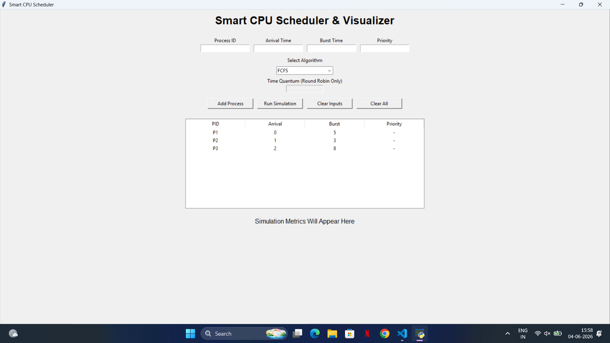
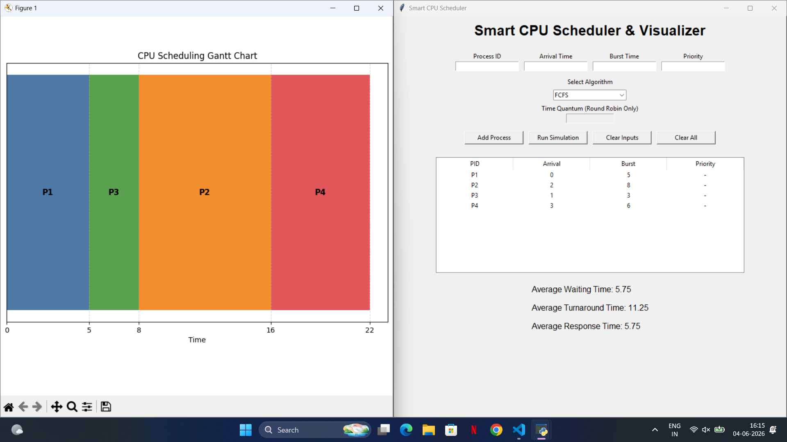

# Smart CPU Scheduler & Visualizer

A Python-based Operating Systems project that simulates and visualizes different CPU Scheduling Algorithms with an interactive graphical user interface (GUI).

## Features

* Interactive GUI using Tkinter
* CPU Scheduling Algorithm Simulation
* Gantt Chart Visualization
* Performance Metrics Calculation
* Input Validation & Error Handling
* Professional Process Table

## Key Concepts Demonstrated

* Operating Systems Scheduling Algorithms
* Process Management
* CPU Scheduling Simulation
* Data Structures & Algorithmic Logic
* GUI Development using Tkinter
* Data Visualization using Matplotlib
* Performance Analysis & Metrics Computation


## Implemented Algorithms

### 1. First Come First Serve (FCFS)

Processes execute based on arrival order.

### 2. Shortest Job First (SJF)

Processes with smaller burst time execute first.

### 3. Priority Scheduling

Processes execute according to assigned priority values.

### 4. Round Robin (RR)

Processes share CPU time using a configurable Time Quantum.

## Performance Metrics

* Average Waiting Time
* Average Turnaround Time
* Average Response Time

## Tech Stack

* Python
* Tkinter
* Matplotlib

## Project Structure

```text
smart-cpu-scheduler/
│── algorithms/
│   ├── fcfs.py
│   ├── sjf.py
│   ├── priority.py
│   ├── round_robin.py
│
│── gantt_chart.py
│── metrics.py
│── main.py
│── requirements.txt
│── README.md
```

## Installation

1. Clone the repository:

```bash
git clone <your_repo_link>
```

2. Install dependencies:

```bash
pip install -r requirements.txt
```

3. Run the application:

```bash
python main.py
```

## Screenshots

### Main Interface


### Simulation Output


## Future Improvements

* Dark Mode UI
* Export Results to CSV/PDF
* Additional Scheduling Algorithms
* Embedded Gantt Chart inside GUI


This project demonstrates practical implementation of core Operating Systems concepts through interactive scheduling simulation and visualization.

## Author

Rithwik Nalla
